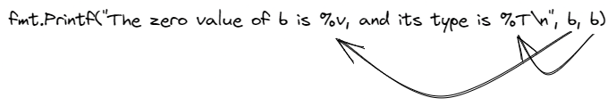

import YouTube from "../../components/YouTube.astro";

In this article we will talk bout Runes and Bytes in Go (Golang). We will see how to declare variables of these types, and how can we use `Printf` function from `fmt` package.

## What is `Printf` function and how to use it?

In my previous blog [post](https://zoranstankovic.com/numeric-data-types-explained-in-go-golang/), we saw how to use reflect package and its `TypeOf` function to check type. But today, we will see another way to check for type using the `Printf` function from the `fmt` package. `Printf` is a function in Go that prints formatted text to an output stream. The function has the following signature:

`func Printf(format string, a ...any) (n int, err error)`

According to documentation, `Printf` formats according to a format specifier and writes to standard output. It returns the number of bytes written, and any write error encountered. The format specifier is just a string that contains placeholders for the arguments filled in by the function. Additionally, it is conventional not to be concerned with any error that the `Printf` function returns.

<YouTube id="e24WQGDiorI" title="Bytes, Runes and Printf In Go" />

## What is byte?

A byte is just an alias for an unsigned 8bit integer (uint8) whose value can be from 0 to 255. We are using bytes to represent characters from ASCII code. To declare a byte, we use the byte keyword.

```go
var b byte
```

Let's print the b value and type.

```go
fmt.Printf("The zero value of b is %v, and its type is %T\n", b, b)
```

Here we have `fmt.Printf` and then format specifier as a string "The zero value of b is %v, and its type is %T\n", then arguments b and b. Those arguments will fill those two spots, so %v is a placeholder for the first b, and %T is a placeholder for the second b.



Here the `%v` is a format verb used to print the variable's value, and `%T` is used to print its type. At the end of the string, we can see `\n`. It's a newline character, and we use it to create a new line.

If you want to check what format verbs we can use for our `Printf` function, check this [link](https://pkg.go.dev/fmt#hdr-Printing). When we run the program, we see that the zero value for a byte is 0, and its type is a `uint8`.

```shell
$ go run main.go
The zero value of b is 0, and its type is uint8
```

Now we can assign a letter b to it. When we assign a value to a byte, we need to use single quotes.

```go
b = 'b'
fmt.Printf("The value of b is %v, and its type is %T\n", b, b)
```

Let's run the program now and see the value of our byte. Here we can see that the decimal value of b in ASCII code is 98.

```shell
$ go run main.go
The value of b is 98, and its type is uint8
```

To see the character representation of byte, we need to use another format verb, %c.

```go
fmt.Printf("The character representation of b is %c, and its type is %T\n", b, b)
```

When we run the program now, we can see that the character representation of b is b.

```shell
$ go run main.go
The character representation of b is b, and its type is uint8
```

I have one assignment for you. You can do it now, or you can download the code from my GitHub [page](https://github.com/zoranstankovic/go-basics/tree/bytes-and-runes) and do all the assignments later.

I want you to declare a variable `c` to be of type `byte`. Then assign a value of `99` to it. And in the end, you need to print the decimal value, its character representation, and its type using the `fmt.Printf` function.

The output should look like this:

```shell
The value of c is 99.
The character representation is c.
The type is uint8.
```

## What runes are and how to declare them

A rune is an alias for `int32`, and we are using it to store characters from the Unicode encoded in UTF-8 format. A Unicode is a code that assigns a unique number to every character in every written language.

Let's declare a variable a of rune type and print its value and type using the Printf function.

```go
var a rune
fmt.Printf("The zero value of a is %v, and its type is %T\n", a, a)
```

When we run the program, we can see. The zero value of a is zero, and its type is int32.

```shell
$ go run main.go
The zero value of a is 0, and its type is int32
```

We can initialise runes using single quotes like this.

```go
a = '🦊'
fmt.Printf("The character is %c\n", a)
fmt.Printf("The type of a is %T\n", a)
fmt.Printf("The unicode value is %U\n", a)
```

When we run the program, we see that the character representation is an emoji of a fox face.

```shell
$ go run main.go
The character is 🦊
The type of a is int32
The unicode value is U+1F98A
```

Its type again is int32, and the Unicode value is U+1F98A.

To print its Unicode value, we are using `%U` format verb. We can also see that the Unicode code point is printed in hexadecimal format.

Also, when declaring a rune, we can use a shorthand syntax operator like this.

```go
r := 'ᚱ'
fmt.Printf("The character is %c\n", r)
fmt.Printf("The type of r is %T\n", r)
fmt.Printf("The unicode value is %U\n", r)
```

When we run the program now, we can see that inferred type is int32, and the Unicode value for the runic letter R is U+16B1.

```shell
$ go run main.go
The character is ᚱ
The type of r is int32
The unicode value is U+16B1
```

Also, we can initialise rune using the Unicode like this:

```go
r := '\u16b1'
fmt.Printf("The character is %c\n", r)
fmt.Printf("The type of r is %T\n", r)
fmt.Printf("The unicode value is %U\n", r)
```

We can see the same message printed again if we run the program.

```shell
$ go run main.go
The character is ᚱ
The type of r is int32
The unicode value is U+16B1
```

I also previously mentioned that we can declare bytes using single quotes, which is true. But, we need to declare byte variables explicitly and not let the compiler infer their type. Let's see what I mean by this.

```go
	var a byte = 'a'
	b := 98
	c := 'c'

	fmt.Printf("Type of a is %T\n", a)
	fmt.Printf("Type of b is %T\n", b)
	fmt.Printf("Type of c is %T\n", c)
```

If we don't explicitly declare a variable as byte type and let the compiler infer it, it will have either int or int32 type. The default type when using single quotes is rune type.

```shell
$ go run main.go
Type of a is uint8
Type of b is int
Type of c is int32
```

One more thing is that byte type memory size is one byte, and rune type can take up to 4 bytes.

As an assignment here, I was hoping you could go to this website: https://unicode-table.com/en/, choose any letter, symbol or emoji that you like, and use it to create a new rune variable. Then print the variable character representation and also its Unicode value.

## Summary

In summary, we learned what bytes and runes are. How can we declare and use them, and what types do they have? Also, we learned about the Printf function and how to use it. We learned some format verbs we can use with the Printf function.

Remember to check the link to my GitHub [page](https://github.com/zoranstankovic/go-basics/tree/bytes-and-runes) to download the code and do the assignments. Also, you can find solutions to them in the solution folder.