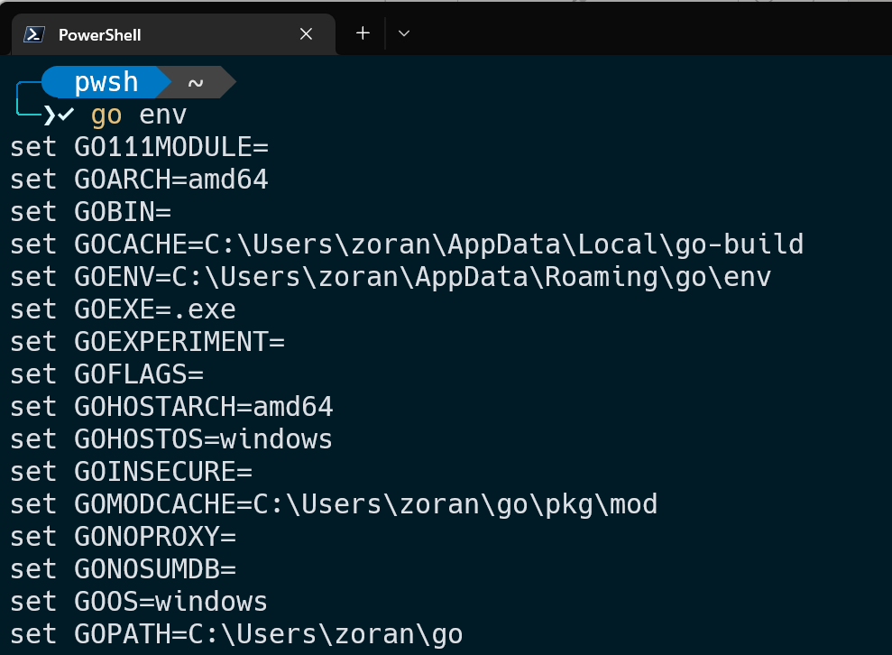
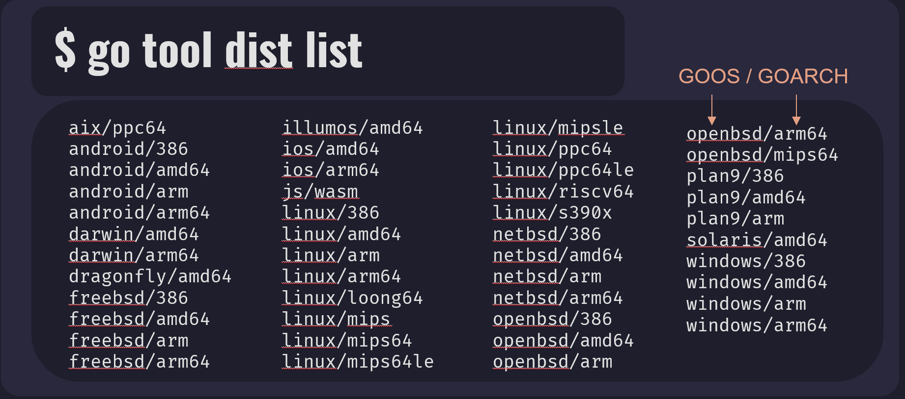
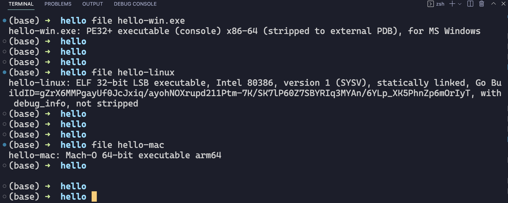

import YouTube from "../../components/YouTube.astro";

In this blog post we will talk about how to compile Go programs for multiple operating systems.

When we want to compile Go program we are using go build command. We already saw how to use it in my previous blog posts. But let's make a recap here.

<YouTube id="HHNVnW3OAQs" title="Compile Go Programs for Multiple OS" />

```bash
go build [-o output] [build flags] [packages]
```

The command is `go build` with optional arguments like `-o` for output, or build flags or packages.
When we build main package, the compiled program name will be same as the first source file.

```bash
go build hello.go
```

This command will compile program with name `hello` or `hello.exe`.
Now if we want to name our compiled program differently we would use `-o` flag.
Let's say that we want to call our program `greetings` instead of `hello`. We would execute this command.
On Windows:

```bash
go build -o greetings.exe hello.go
```

On Mac OS and Linux just omit `.exe` suffix, so it will be:

```
go build -o greetings hello.go
```

This will create an executable file named `greetings` or `greetings.exe`.
Go give us possibility to build programs for multiple platforms (Windows, Linux, Mac OS, Solaris and more) without using that platform. For example, I can build Linux and Mac OS executable files on my Windows machine.
To build a program for some platform we need to know two things:

1.  Operating system
2.  Processor architecture

To find out those two values for our current running platform. We can use `go env` command. This command will help us to examine the values of Go environment variables.

```bash
go env
```

When we run this command we will see a big list of environment variables.

We are just interested in two of them. One is `GOOS` which stands for Go Operating System, and the other one is `GOARCH` and stand for Go Architecture. I just want to mention that `GOOS` and `GOARCH` variables default to the values of `GOHOSTOS` and `GOHOSTARCH` respectively. The values for `GOHOSTOS` and `GOHOSTARCH` will be automatically determined by our host OS and architecture.
To just see values for those two variables we can run this command:

```bash
go env GOOS GOARCH
```

And we will see those values.

```bash
windows
amd64
```

On this example we can see that `GOOS = windows` so I am running Windows OS, and `GOARCH = amd64` is a generic name for x86-64 bit architecture.
To see all possible platform/architecture combinations, that Go can build programs for, we can use `go tool` command for that. Command is:

```bash
go tool dist list
```

This will output a list of currently supported platforms and architectures for installed Go version on your machine. This list may change with future versions of Go.

In this list we can see that output is formatted like `GOOS/GOARCH` combination. So first value is operating system and second is processor architecture.
Now that we know our current `GOOS` and `GOARCH` values and all possible ones. Let’s see how we can use them to build Go programs for different platforms.
We can see `GOOS` and `GOARCH` values for three main operating systems:

1. Windows
   1. GOOS: windows
   2. GOARCH: amd64
2. Linux
   1. GOOS: linux
   2. GOARCH: 386
3. Mac OS:
   1. GOOS: darwin
   2. GOARCH: arm64

MacOS is based on Darwin operating system so value for `GOOS` is `darwin`.
Example file that we will use to compile is “Hello World”. You can find code [here](https://go.dev/play/p/GiqGli23uLY).
Navigate to your code directory in your terminal.
To compile program for Windows we will run `go build` command with next options:

```bash
GOOS=windows GOARCH=amd64 go build -o hello-win.exe hello.go
```

Also because I am on Windows machine and my default values for `GOOS` and `GOARCH` are same as one specified in command, we can omit them. And in that case Go would use `GOHOSTOS` and `GOHOSTARCH` values to build a program. We can see that now in our project directory we have new `hello-win.exe` file.
Next let's compile same program for Linux with Intel 80386 microprocessor. Command is:

```bash
GOOS=linux GOARCH=386 go build -o hello-linux hello.go
```

Same here, we can see that new file `hello-linux` was built.
And now to compile program for Mac OS with Apple Silicon which uses `ARM64` architecture. We will execute this command:

```bash
GOOS=darwin GOARCH=arm64 go build -o hello-mac hello.go
```

Once again we can see `hello-mac` file inside our directory.
If you are on Linux or Mac OS, you can use the `file` command to get more information about files that we just created.
To use it type file than name of the file you want to examine. Here we can see the outputs for our built files.
