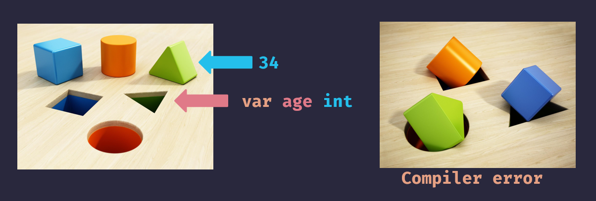
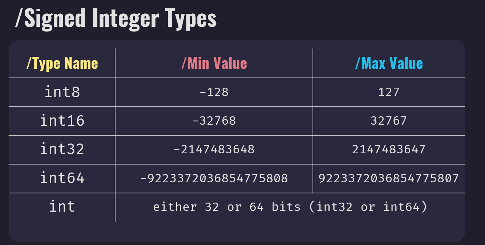
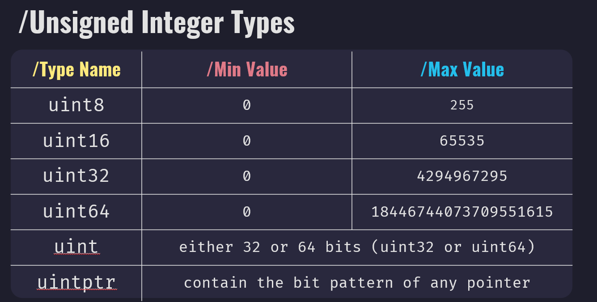
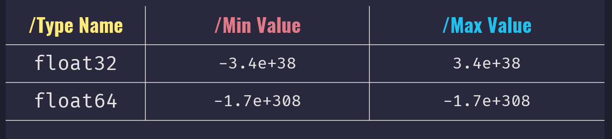

import YouTube from "../../components/YouTube.astro";

In this blog post we will talk about the difference between statically vs. dynamically typed languages. What are data types? Then introduce data types in Go.

Go is a statically typed programming language. This means that variables always have a specific type, and that type cannot be changed. If you work with dynamically typed programming languages like JavaScript or Python, this is an important concept to learn.

<YouTube id="PmwEJVTH7cY" title="Data Types In Go" />

How I like to imagine statically typed language is like a shape sorter toy. Once we declare a variable memory is allocated for it, and we cannot change it, it's like this defined shape space on this toy here. We can just assign values to it, putting these shape pieces inside the shape spaces.

If we try to assign the wrong value to a declared variable, the compiler will throw us an error. It is like we are trying to fit those shapes into the wrong spaces.

## What are the differences between statically and dynamically typed languages?

Statically typed (also known as “strongly typed”) languages will perform type checking at compile time and dynamically typed (also known as “loosely typed” or “weakly typed”) languages perform type checking at the runtime.
This means that code written in statically typed language (like Go) won't compile if it contains errors (types are used incorrectly). Code written in dynamically typed languages (like JavaScript) can compile but won't run properly (or at all). When I said won't run properly, I mean that at runtime types are converted from one type to another in order to execute the program.
Also, with statically typed languages, you need to declare the data types of your variables before using them, and with dynamically typed languages you don't.
In Go you have an option here to either explicitly declare a type or to let a compiler infer the type.
Here we can see an example:

```go
// explicitly declared
var age int
age = 34
// infered
var age = 34
```

For our examples in Go, we will explicitly declare types just to help us see the differences clearly.
If you want to learn more about variable declaration in Go, please check my other post[link here].

Here we have a Go example:

```go
var age int
age = 34
```

JavaScript example:

```js
let age = 34
```

In both examples, we are creating a variable called `age` and assign a value 34 to it. Difference is that in Go example, on the first line `var age int` we declared a variable and also define its type as `int`. In JavaScript, variable data type is determined based on assign value.

There are always pros and cons using dynamically or statically type languages. Some pros for using statically typed language is that a compiler can catch some bugs, better performance, code editors can offer code completion, etc.
Some pros using dynamically typed language: it's faster to write software, no need to wait for a compiler to compile code, shorter learning curve.

## What bugs our Go compiler can catch for us?

We can see one example in Go:

```go
var age int
var years string
age = 34
years = "5"
fmt.Println("My age in five years:", age + years)
```

same example in JavaScript:

```js
let age = 34
let years = '5'
console.log('My age in five years:', age + years)
```

In both examples, we are creating variables called `age` and `years` and assign them values. For age is integer 34 and years is a string 5. And then on the last line we are printing the message “My age in five years: age + years”.
When we try to run, our program won't even compile. Compiler will through an error `invalid operation: age + years (mismatched types int and string)`.
JavaScript program will run and print “My age in five years: 345.” and we expected `39`.
One more example. Here we have Go code.

```go
var myAge int
myAge = 34
mAge = myAge + 5 // undeclared name: mAge
```

Same example in JavaScript

```js
myAge = 34
mAge = myAge + 5 // mAge = 39
```

The intention was to add `5` to `myAge` and save in `myAge`, but we made a mistake and type `mAge` instead and JavaScript will create a new variable named `mAge` for us and assign `39` to it. While Go compiler will throw an error `undeclared name: mAge`.

## What is a data type?

In programming, a data type is a classification that specifies which kind of value a variable may hold. Data types allow programming languages to understand how to operate on and process data. For example, if a data type is a `string`, it is possible to check the length of it or to concatenate it with another string.

## Data Types in Go

In Go language, we have primitive and composite data types.
Primitive data types are: Boolean, Numeric, and Strings.
Composite data types are array, struct, pointer, function, interface, slice, map, and channel.
In this post, we will focus on primitive data types. Composite data types we will explain in future posts.

### Boolean

A Boolean data type can only have two values: `true` and `false`. And in code it is represented with a `bool` keyword. The zero value for a `bool` is `false`.

```go
var isActive bool // zero or default value here is set to false
var isMovie = true
```

### Numeric Types

We have 3 types of numeric data types in Go: Integers, floating-point, and complex values.

#### Integers

Integers are positive, zero or negative whole numbers. To declare integer in Go, we can use:

```go
var age int // zero or default value here is 0
age = 34
```

Integer zero value is `0`.
We have two types of integers: `signed` and `unsigned`. Signed integers hold negative, zero and positive whole numbers. Unsigned integers hold zero and positive whole numbers.
Here we can see a table with types of signed integers and their values.

We have `int` type which size depends on underlying architecture. If we are using 32-bit architecture, integer size will be 32-bit and for 64-bit architecture size usually will be 64.
In this table, we can see all unsigned types and their values.

`uint` type size depends also on underlying architecture same as `int`.
Type `uintptr` in Go is an integer type that is large enough to contain the bit pattern of any pointer. It is an integer representation of a memory address.
Hint: For integers, rule of thumb is to always use `int` unless you have a specific reason to use a size or unsigned integer type.

We also have two aliases for integers:
One is `byte` which is an alias for `uint8` and `rune` which is an alias for `int32`.

#### Floating-point Numbers

Floating-point numbers represent the real numbers in Go language.
We have two types: `float32` and `float64`.


Like the integer types, the zero value for the floating point type is `0`.
When we don't provide type, `float64` is a default type.

```go
var height = 156.3 // default type is float64
```

#### Complex Numbers

Complex numbers are used to deal with real and imaginary numbers. We are using floating-point numbers in complex numbers for the real and imaginary parts. `Complex64` uses `float32` values to represent the real and imaginary parts and `complex128` uses `float64` values for that.
The zero value for complex numbers has `0` assigned to both the real and imaginary parts of the number.

#### Strings

Strings are sequence of numbers, letters and symbols surrounded by double quotes `"`.
Also in Go, we can define strings using back tick symbol more about that in future post.
Strings in go are immutable. Once we create a string, it is impossible to change the content of it.
The zero value of the string is empty string `“”`.
Here are some string examples:

```go
var greeting string = "Hello"
var golang = "Golang"
var birthday = "12th June 1999"
```