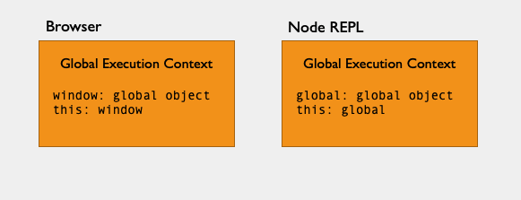
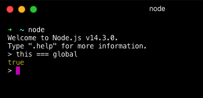
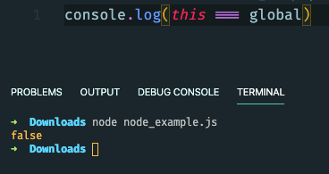
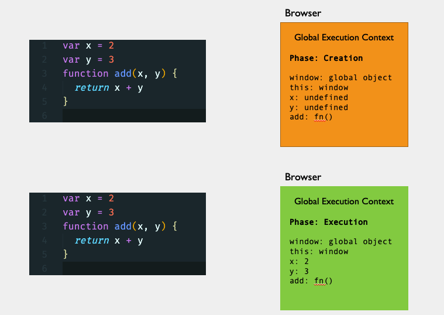

In this blog post I will try to give answers to these questions:

1. What is the execution context in JavaScript?
2. What type of execution context exists?
3. What is Hoisting?

One of the essential concepts in JavaScript is learning about “Execution Context.” Once we understand what it is, it will be much easier for us to understand more advanced topics like Hoisting, Scope chains, and Closures.

**Execution Context** is a concept that describes the environment in which your code is running. Also, it allows the JavaScript engine to manage the complexity of interpreting and running your code.

Now let us see how we can create an Execution Context. When we run our JavaScript application, even if that is an empty JavaScript file, JavaScript creates the first Execution Context called “Global Execution Context.”

### Global Execution Context

Initially, this Global Execution Context comprises two things:

1. a `global object` and
2. a variable called `this`

If we execute code in the browser outside of any function, this refers to a global object, which in this case is the window. It doesn’t matter if we are in strict mode.

If we execute this code in Node, at the top level, this is equivalent to the global object which is called `global`.

Global Execution Context in Browser and Node REPL


I won’t go into any details here, but in Node this is only true for the REPL. If we execute this code,

```javascript
this === global // returns true
```

inside of Node REPL, we will get `true`.



But inside of the Node `module`, execution of the code below will return `false`.

```javascript
console.log(this === global) // returns false
```


It is because inside of node module, `this` refers to `module.exports`. In this blog post, we will focus on Execution Context inside of Browser.

Execution Context has two phases: **Creation** and **Execution** phase. We can see that in the picture below.

```javascript
var x = 2
var y = 3
function add(x, y) {
  return x + y
}
```


In Global `Creation` phase, JavaScript engine, as we mentioned earlier, will create a `global` and `this` objects, and also will allocate memory space for `variables` and `functions`. In this phase, the JavaScript engine will assign to the variable declarations a default value of `undefined` but will place whole function declarations in memory. This brings us to one term mentioned at the beginning of this blog post, and that is `Hoisting`. We call assigning default value of `undefined` to variable declarations in the `Creation` phase `Hoisting`.

> **Tip**: It’s always better to first define your variables and then use them, don’t rely on `Hoisting`.

Then JavaScript engine starts to parsing and executing your code line by line. We call this process of code execution `thread of execution`. In this phase, the JavaScript engine also assigns the actual values to already declared variables.

Besides the Global Execution Context, there is **Functional** Execution Context. In the next blog post, I will tell you more about Functional Execution Context and the differences between them.

### Recap

- **Execution context** in JavaScript is a concept that describes the environment in which your code is currently running.
- Execution context has two phases:
  - **Creation** and
  - **Execution**
- There are two execution contexts in JavaScript:
  - **Global** and
  - **Functional** (or local)
- JavaScript engine creates **Global Execution Context** once it runs JavaScript application.
- JavaScript creates two objects for us inside of Global Execution Context:
  - `global object` and
  - a variable, `this` that, in the Browser, points to the same global object which is `window`.
- **Hoisting** is assigning a default value of `undefined` to variable declarations in the `Creation` phase.