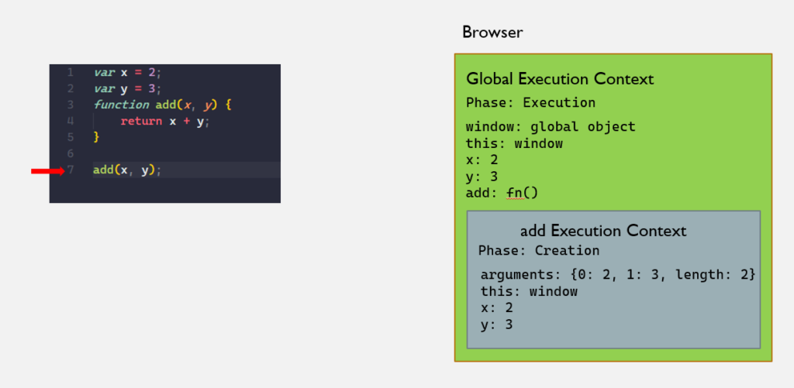
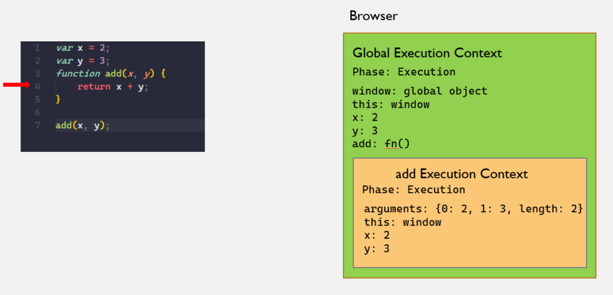
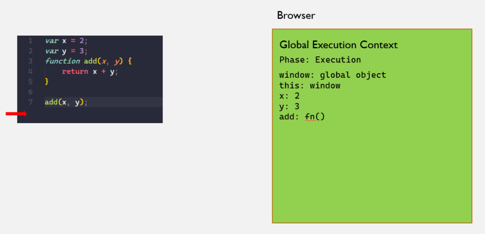
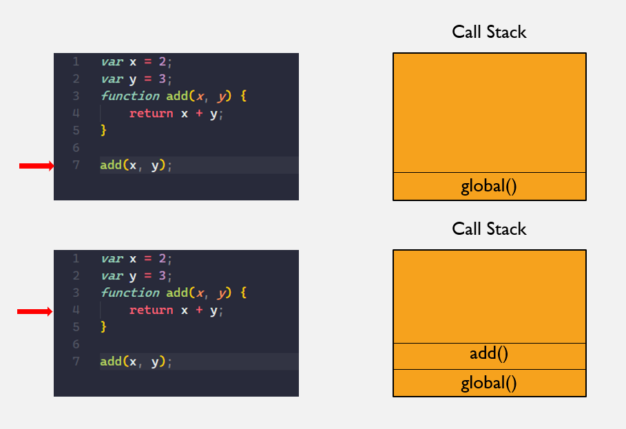
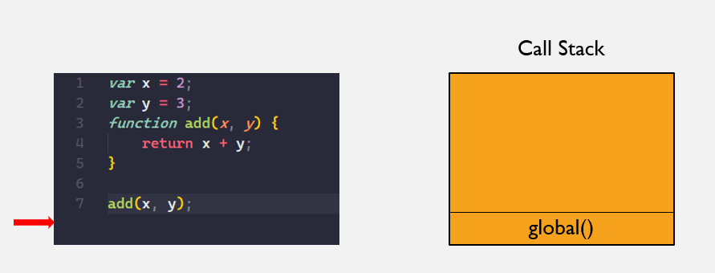

In this second part, I will try to answer these questions:

1. What is the difference between **Global Execution Context** and **Functional Execution Context**?
2. What is a **Call Stack**?

In the [first part](./execution-context-in-javascript-pt-1), I explained what is **Global Execution Context**, and its two phases `Creation` and `Execution`. Also, we know that Global Execution Context is created when the JavaScript engine first starts executing your code. It creates a Function Execution Context when the function is invoked. We know that function is invoked when we put parenthesis after the function name e.g. `myFunction()`.
Now we know when the Functional Execution Context is created, let see what is the difference between Global and Functional Execution Context.

## Global Execution Context - Creation Phase

1. Create a `global` object
2. Create a variable called `this`
3. Allocate memory space for `variables` and `functions`
4. Assign to a variable declaration a default value of `undefined`, and place whole function declarations in memory.

## Functional Execution Context - Creation Phase

1. Create an `arguments` object
2. Create a variable called `this`
3. Allocate memory space for `variables` and `functions`
4. Assign to a variable declaration a default value of `undefined`, and place whole function declarations in memory.

Here we can see that the only difference is the first step. Instead of creating `a global object`, Functional Execution Context creates an `arguments` object. It's a logical step here in our program. We only need to have one `global` object, and that is only when Global Execution Context is executed. But whenever we call (invoke) a function, new Functional Execution Context is created, and it always creates arguments object for invoked function.

Let's return to our previous example and see visually what happens.

On line 7, we can see that we are invoking the `add` function. JavaScript engine creates a new `add` (Functional) Execution Context. We can see that it created for us new `arguments` object with two argument values and default property called length. In our case, length is 2 because we have two arguments.
In the next Execution phase of your Functional Execution Context, JavaScript engine will execute our function line by line, and in our case, we only have a `return` statement so, after line 4 we will go out of our function and also we are going out of `add` (Functional) Execution Context.

In the next picture, we can see that our Functional Execution Context was removed from our diagram. This is because JavaScript engine, when runs our code for the first time and creates Global Execution Context, also creates `Execution Stack` (or `Call Stack`). Because JavaScript is single-threaded, we can only execute one task at the time in our Call Stack.

**Call Stack** is a data structure that JavaScript engine uses to track in which execution context we are in, and where to return to after an execution context is popped off the stack. Let first explain what data structure Call Stack is. Call Stack, at the basic level, uses **Last In, First Out (LIFO)** principle to temporarily store and manage function invocation.

### What is LIFO?

Basically, this means that the last function that we invoked is pushed on top of the stack and is the first to be popped out when the function execution ends. I like to imagine this like a can of tennis balls. First ball that you put in the can will go out last. And the last one goes first.

Same with our functions. Let go once more through our example, but now we will focus only on Call Stack in our diagram.

Until line 7, we only created Global Execution Context and our Call Stack only had it. But on line 7 when we invoked a add function, we pushed it on top of our Call Stack. And once we return the value from our add function, it will be popped off the Call Stack.

## Recap

- JavaScript engine creates **Functional Execution Context** every time function is invoked.
- Difference between **Functional** and **Global** Execution Context is in the first step JavaScript creates in Global Execution Context `global object` and in Functional Execution Context it creates `arguments object` for us. All other steps are the same.
- **Call Stack** is a JavaScript data structure that uses LIFO (Last In First Out) principle, and JavaScript engine uses it to track in which execution context we are, and where to return to after current execution context popped off the stack.
- JavaScript is **single-threaded**, so we can only execute one task at the time.