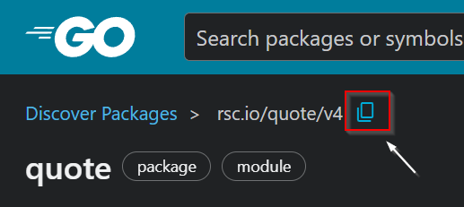

import YouTube from "../../components/YouTube.astro";

In this post we will talk about how to use external libraries in our project and how to create a library in Go and use it locally.

We already mentioned in previous posts what are packages. But let's make a recap.
Packages are just a way to split your code into smaller units that has same purpose or function. And all go source files must belong to a package, each package must belong to a folder. We must have at least one package in any program or a library.
There are two types of packages in Go:

1.  Executable - this is main package with a main function in it that we can run directly from the terminal.
2.  Non-executable or a library - is a collection of code that we package together so that we can use it in other programs.

<YouTube id="bKBoLphAe1Y" title="How to Create Library In Go" />

Our workflow will look like this.

1. We will first create a new `hello` project.
2. And use it to import external package. Here we will see how we can find a package and how to import it and use it.
3. Then we will create a separate library. It will be simple `calculator` library that we will then use inside of `hello` project. Here we will learn how to create and import local package and use it inside of our project.

Let's start with creating our `hello` project.
Open your terminal and navigate to the directory where you want to keep it. And make new directory named `hello`. Navigate to `hello` folder and create a `go.mod` file, using `go mod init` command with a module path. For the module path we can use `example.com/username/hello`. Let's open our hello project in text editor.

```bash
go mod init example.com/[username]/hello // place your username here
```

Now open `hello` folder in your text editor.
Create new `hello.go` file. This package will be executable one. So our file will start with `package main`. And then we will import `fmt` library, followed by main function that will print `Hello World!` to the terminal.

```go
package main

import (
	"fmt"
)

func main() {
	fmt.Println("Hello World!")
}
```

We can check this by using go run command.

```bash
go run hello.go
```

Now that we have our basic program. Let's import external package.

To find Go packages you can check this URL [https://pkg.go.dev/](https://pkg.go.dev/), and search for a package. We want to find a package named `quote`. The one that we are looking is `rsc.io/quote/v4`. Link: [quote](https://pkg.go.dev/rsc.io/quote/v4). Here we can see information about this package. To copy a module path press this copy button here and paste it in our import statement as a string.


```go
// hello.go
package main

import (
	"fmt"
	"rsc.io/quote/v4"
)

func main() {
	fmt.Println("Hello World!")
}
```

Now that we added our new import statement, we need to download this module and add it to our `go.mod` file. To do that, we need to execute `go mod tidy` command.

```bash
go mod tidy
```

This command ensures that the `go.mod` file matches the source code in the module. It adds any missing module requirements necessary to build the current module's packages and dependencies, and it removes requirements on modules that don't provide any relevant packages.
Let's execute it.
After this command is executed module dependencies are automatically downloaded to the `pkg/mod` subdirectory of the directory indicated by the `GOPATH` environment variable. On Windows path is `C:\Users\[user]\go`. Here we can find `pkg` folder, then inside mod folder. When we open `mod` folder we can see our newly added dependency downloaded here.
`go mod tidy` command added a new `require` line to our `go.mod` file for required `quote` package.

```go
// go.mod file in hello package
module example.com/zoran/hello

go 1.19

require (
	rsc.io/quote/v4 v4.0.1
)

require (
	golang.org/x/text v0.0.0-20170915032832-14c0d48ead0c // indirect
	rsc.io/sampler v1.3.0 // indirect
)
```

`quote` package comes with couple of functions that we can use, for this example we will use `Hello()` function. When we check documentation we can see that `Hello()` function returns a greeting as a `string`.
Let's change our hello message to use `quote` package. To use package function we need to use first package name `quote` then . (dot) and then name of the function `Hello()`.

```go
// hello.go
package main

import (
	"fmt"
	"rsc.io/quote/v4"
)

func main() {
	fmt.Println(quote.Hello())
}
```

Let's save and run our code. We can see that new hello message is printed.

```bash
go run hello.go // output: Hello, world.
```

Now that we know how to use external libraries, let's see how to create a non-executable package or a library and use it locally. For this example we will create a simple calculator library with only `Add` function.
We need to navigate to the directory where we have our `hello` project and there create a new folder named `calculator`. Folders `hello` and `calculator` should be now beside each other.

```
- parent directory
	- hello
	- calculator
```

Navigate to `calculator` folder.

```bash
cd calculator
```

First we will create our `go.mod` file. To create it we will again use `go mod init` command with a module path `example.com/username/calculator`.

```bash
go mod init example.com/[username]/calculator // place your username here
```

We can now open our project in text editor. Create a new file named `calculator.go`. All the go files starts with `package` keyword and package name in our case `calculator`.
This will be the simple calculator with only one function named `Add` that will receive as parameters integers `a` and `b` and return integer as a result of `a + b`.

```go
// calculator.go
package calculator

func Add(a, b int) int {
	return a + b
}
```

Notice here how our `Add` function begins with an upper-case letter. This is the Go way to export the function so it can be used in other packages that import our `calculator` package.
To test that this library will compile we will use `go build` command.

```bash
go build .
```

Because this is not an executable program, `build` command wont build any executable files for us. This will only save the compiled package in the local build cache. The URL path to Go cache can be found in `GOCACHE` environmental variable.
Now we created our library but how we can use it in other programs?
Let's open our hello project. We need to do the same thing as we did for our external library, we need to import it. Let's import our `calculator` library.

```go
// hello.go
package main

import (
	"fmt"

	"rsc.io/quote/v4"

	"example.com/zoran/calculator"
)

func main() {
	fmt.Println(quote.Hello())
}
```

To import our package locally we need to do one more additional step. We need to add a `replace` line in our `go.mod` file.

### What is replace?

Let's first explain what replace does. It replaces the content of a module at a specific version with another module version or with a local directory.

```bash
replace module-path [module-version] => replacement-path [replacement-version]
```

We have `replace` keyword with mandatory `module-path` which one we want to replace. Then optional `module-version`, here we can specify version to replace. If we omit the version number, all versions of the module will be replaced with the content on the right side of the arrow. On the right side of the arrow we have `replacement-path` at which Go should look for the required module. This can be a module path or a path to a directory on the file system local to the replacement module. If this is a module path, you must specify a `replacement-version` value. If this is a local path, you may not use a `replacement-version` value.
We can create this replace line from our command line using the `go mod edit` command.

```bash
go mod edit -replace example.com/zoran/calculator=../calculator
```

go mod edit -replace flag than module-path that we want to replace equal sign and then relative path to the replacement module. In our case it's `../calculator`. Which means go out of our current directory which is `hello`, to the parent directory and then there you will find `calculator` folder.
When we execute this command we can see that replace line was added in our `go.mod` file.

```go
replace example.com/zoran/calculator => ../calculator
```

Next step is the same as before we need to execute our `go mod tidy` command:

```bash
go mod tidy
```

After execution this command found the local code in the `calculator` directory, and we can see that `go.mod` file for `hello` has new `require` statement where we require our `calculator` library. Because our `calculator` module doesn't have a semantic version define yet. We can see the pseudo-version number generated after our module-path.

```go
// go.mod file in hello package
module example.com/zoran/hello

go 1.19

require (
	example.com/zoran/calculator v0.0.0-00010101000000-000000000000
	rsc.io/quote/v4 v4.0.1
)

require (
	golang.org/x/text v0.0.0-20170915032832-14c0d48ead0c // indirect
	rsc.io/sampler v1.3.0 // indirect
)

replace example.com/zoran/calculator => ../calculator
```

Now let's use our `calculator` library.

```go
// hello.go
package main

import (
	"fmt"

	"rsc.io/quote/v4"

	"example.com/zoran/calculator"
)

func main() {
	fmt.Println(quote.Hello())
	fmt.Println("2 + 3 =", calculator.Add(2, 3))
}
```

Let's print a message “2 + 3 =” and then use our `Add` function to calculate 2 + 3. We will call `Add` function and give it 2 and 3 as arguments. To do this we need to use `calculator` as a prefix and then . (dot) and name of our function. This function will return 5. When we run our program we can see our hello message and also 2 + 3 = 5.

```bash
go run hello.go
// output
Hello, world.
2 + 3 = 5
```