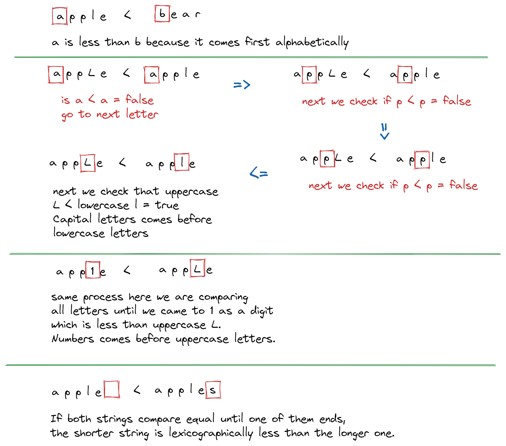

import YouTube from "../../components/YouTube.astro";

In this blog post we will talk about Strings in Go. We will see how to declare string variables and what operations we can perform on them.

Let's see now what strings are and how we can declare them. The Go programming language has native support for Unicode strings, encoded using UTF-8 character encoding. This means that string constants and identifiers can contain any Unicode character without special escaping or encoding. Strings are just an immutable sequence of bytes. There are two ways to declare strings in Go using double quotes or using backquotes or backticks.

<YouTube id="9HZvP6YOmPE" title="Strings In Go" />

```go
// declare string using double qoutes
s := "日本語"
// or backticks
s := `日本語`
```

When using double quotes, we are creating an interpreted string literal, and inside of double quotes, we can use escape sequences. In my previous post, we already saw \\n a new line character. We also have \\t for tab, double \\\\ for backslash etc. When using backticks, we create a raw literal string; inside it, we cannot use any escape characters.
Let's declare a variable tvShow to be the type of string and see its zero value and type.

```go
var tvShow string

fmt.Printf("The zero value is %q, and type is %T\n", tvShow, tvShow)
```

We can see that the zero value is an empty string, and its type is a string. We can use the %q format verb to print an empty string. What this will do for us is to escape safely double quotes.

```shell
# output
go run main.go
The zero value is "", and type is string
```

Next, we will create two string variables. For the first one, we will use double quotes, and for the second one, we will use backticks.

```go
shoppingList := "\tBread\n\tApples\n\tEggs"
shoppingList2 := `	Bread
Apples
Eggs
`

fmt.Println("Shopping List 1:")
fmt.Println(shoppingList)
fmt.Println("Shopping List 2:")
fmt.Println(shoppingList2)
```

In our first string literal, we are using \\t for tab and \\n for new line. And for the second one, where we use raw literal string, we don't need to use escaping sequences. We can see that with backticks, we can create multiline strings, so usually, we will use them when we need to create HTML templates, JSON literals etc. For everything else, use double quotes.

```shell
# output
go run main.go
Shopping List 1:
        Bread
        Apples
        Eggs
Shopping List 2:
        Bread
        Apples
        Eggs
```

We saw the same results for both strings when we ran the program.

## What operations can we perform with our string?

We can use all comparison operators to compare two strings. When comparing two strings, Go uses a lexicographical comparison. In computer science, lexicographical order is how words are alphabetically ordered based on how they are spelt. This is also known as dictionary order. They are compared from left to right, character by character. The string with the smaller character at the first position where there is a difference is considered less than the other string. For example, "apple" would be less than "bear" because "a" is before "b" in the alphabet.


But also, an apple with an uppercase L is less than a lowercase apple. So we will compare letter by letter from left to right. We can see here that the first three letters are the same, but the fourth is not the same uppercase L is less than lowercase l. We now know that capital letters come before lowercase letters. And, if we have a digit in a string, for example, app1e, it is less than appLe with uppercase L. In this example here, we can see that numbers come before uppercase letters. So the order of precedence here is first digits, then uppercase and at the end lowercase letters. Also, in this example here, where we have an apple compared with apples, we can see that if both strings compare equal until one ends, the shorter string is lexicographically less than the longer one.

```go
fmt.Println("apple < bear =", "apple" < "bear")
fmt.Println("appLe < apple =", "appLe" < "apple")
fmt.Println("app1e < appLe =", "app1e" < "appLe")
fmt.Println("apple < apples =", "apple" < "apples")
```

When we run the program, we can see that all four statements are true.

```shell
# output
go run main.go
apple < bear = true
appLe < apple = true
app1e < appLe = true
apple < apples = true
```

So when we want to check for lexicographical order, we can use `<`, `<=`, `>`, `>=` comparison operators. And to check if two strings are equal or not, we can use `==` or `!=` comparison operators.
Let's assign the value of Good Doctor to our tvShow variable. Let's introduce another variable, myFavoriteTvShow to be also Good Doctor, and check for equality.

```go
tvShow = "Good Doctor"
myFavoriteTvShow := "Good Doctor"

fmt.Println("Is this my favorite tv show:", tvShow == myFavoriteTvShow)
```

When we run the program, we can see:

```shell
go run main.go
Is this my favorite tv show: true
```

Before we continue to the next operation, I want to return to Printf quickly and explain the difference between %s and %q format verbs. As we already saw, %q will escape double quotes, and when we use %s, it will print a string without quotes. Let's see an example here.

```go
fmt.Printf("My favorite tv show is %q.\n", tvShow)
fmt.Printf("My favorite tv show is %s.\n", tvShow)
```

We have two Printf functions, one with %q and one with %s format verb. Let's run the program and see the output.

```shell
go run main.go
My favorite tv show is "Good Doctor".
My favorite tv show is Good Doctor.
```

We can see that the first one has double quotes, and the second one using %s doesn't.
We can access arguments in the Printf function by location. Let's see what I mean by this.

```go
fmt.Printf("The value of tvShow is %q, and its type is %T\n", tvShow, tvShow)
```

We have Printf function with the format string "The value of tvShow is %q, and its type is %T", and then we have two tvShow arguments. What we can do here is to remove one tvShow argument, and then in brackets in front of the format verb character, put the number of argument position. The argument position starts with 1.

```go
fmt.Printf("The value of tvShow is %[1]q, and its type is %[1]T\n", tvShow)
```

We can see the same result for both Printf functions when running the program.

```shell
go run main.go
The value of tvShow is "Good Doctor", and its type is string
The value of tvShow is "Good Doctor", and its type is string
```

So to make it clear, let's see another example with two different arguments. Here we can see that we used two arguments in three places.

```go
fmt.Printf("My favorite color is %[1]s, my favorite food is %[2]s, and the sky is %[1]s.\n", "blue", "pizza")
```

When we run the program now, we can see:

```shell
go run main.go
My favorite color is blue, my favorite food is pizza, and the sky is blue.
```

This is how we can access arguments by location.

Let's continue with our string operations. We can also concatenate two strings using the + operator.

```go
fmt.Println("My favorite tv show is " + tvShow)
```

When we run the program now, we can see:

```shell
go run main.go
My favorite tv show is Good Doctor
```

We can access a single-string character using the bracket notation []. Strings have a zero-based index. So if we want to get the first letter of our tvShow variable value, we will use this syntax: `tvShow[0]`.

```go
fmt.Println("The first letter of tvShow is:", tvShow[0])
fmt.Printf("Type of first letter is %T\n", tvShow[0])
```

```shell
go run main.go
The first letter of tvShow is: 71
Type of first letter is uint8
```

When we print its value, we can see that it's a 71, and its type is uint8 which is a byte. So we can see that using the index operator on a string will return a byte value, not a character (like in other languages). Also, Go strings are immutable, meaning we cannot change an individual character in a string variable, but we can reassign its value. So if I try to change the value of the first character from G to B, we will get an error.

```go
tvShow[0] = 'B' // we cannot do this.
```

Let's try to run the program. We can see the error message here.

```shell
go run main.go
# command-line-arguments
.\main.go:95:2: cannot assign to tvShow[0] (value of type byte)
```

But it is possible to reassign the tvShow value to another value, for example, "The Lord of the Rings".

```go
tvShow = "The Lord of the Rings"
```

When we run the program now, we can see:

```shell
go run main.go
My favorite tv show is The Lord of the Rings
```

Let's define a new song string variable and initialise it to "What does the fox say?". We can check the length of it using the `len` function.

```go
song := "What does the fox say?"

fmt.Println("the length of the song string is:", len(song))
```

If I run the program now, we will see that the length of the song string is 22.

```shell
the length of the song string is: 22
```

Let's use some emojis in our string. If we declare a new variable, song2, and assign the string value of "What does the fox say?" instead of the word fox, we use the fox emoji. What will the length of our string be?

```go
song2 := "What does the 🦊 say?"
fmt.Println("the length of the song2 string is:", len(song2))
```

If you said 23, you would be right.

```shell
the length of the song2 string is: 23
```

It may be better to see this as an isolated example here we can check the length of the fox string and fox face emoji.

```go
fmt.Println(len("fox"), len("🦊"))
```

```shell
3 4
```

We can see that it prints 3 and 4. But obviously, we have only one emoji. This means the `len` function returns bytes and not the number of characters like in other languages. You may now ask yourself, "Okay, Zoran, but how can I count characters and not bytes?". This is where the utf8 package and its RuneCountInString function come to the rescue.
As we can see in the documentation, the [RuneCountInString](https://pkg.go.dev/unicode/utf8#RuneCountInString) accepts a string as an argument and returns an integer, the number of characters (runes) in a string.
Let's print two statements using Println functions, both using utf8.RuneCountInString functions to print the length of song2, fox string, and fox face emoji.

```go
fmt.Println("the length of the song string is:", utf8.RuneCountInString(song2))
fmt.Println(utf8.RuneCountInString("fox"), utf8.RuneCountInString("🦊"))
```

```shell
the length of the song string is: 20
3 1
```

We can see now when we run the program, we have 20 characters in the song2 string, and also, we can see that instead of 4 bytes, we now have one rune for the fox face emoji.

```go
// Assignment 1
// Declare two variables, firstName and lastName
// and initialize them to your first and last names
// Then define a third variable, fullName, that will be the concatenated string
// of firstName and lastName. Don't forget to use space between them.
// And in the end, print a message
// "I am [your full name], and my favorite emoji is [emoji here]."
// using the fmt.Printf function.
// visit this site to find an emoji https://unicode-table.com/en/

// Assignment 2
// Using the Printf function and double quotes (string literal)
// print this message to the console.
// Use Windows as an argument for Printf function.
// Output:
// On "Windows" GOPATH is in "C:\Users\[profile_name]\go".
```

## Summary

In summary we saw what strings are. How can we declare and use them? How can we compare two strings and concatenate them using the plus operator? We saw that strings in Go are immutable sequences of bytes. Strings in Go are Unicode out of the box. We learned how to use the `len` function to check the length of the string. Also, we saw that `len` returns a number of bytes, and if we want to check the number of characters in a string, we need to use the `RuneCountInString` function from the utf8 package. We saw how to use escape sequence characters in our string literals using the backslash. Also, we learned more format verbs we can use with the Printf function and how to access arguments by location.

Check the link to my [GitHub](https://github.com/zoranstankovic/go-basics/tree/strings) page in the description to download the code and do the assignments. Also, you can find solutions to them in the solution folder.